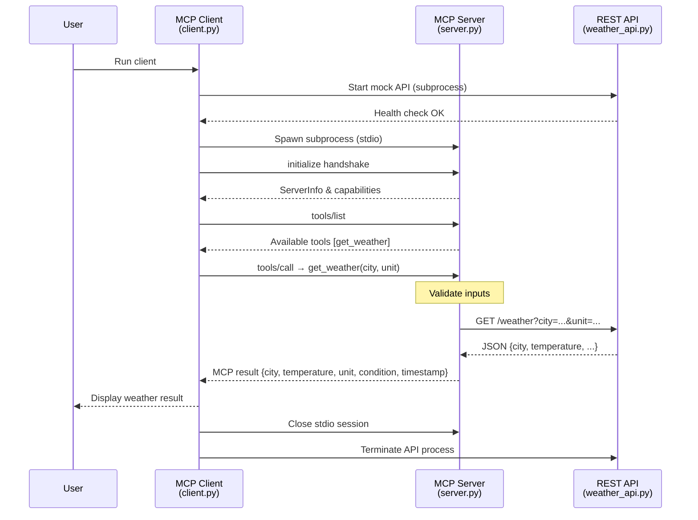
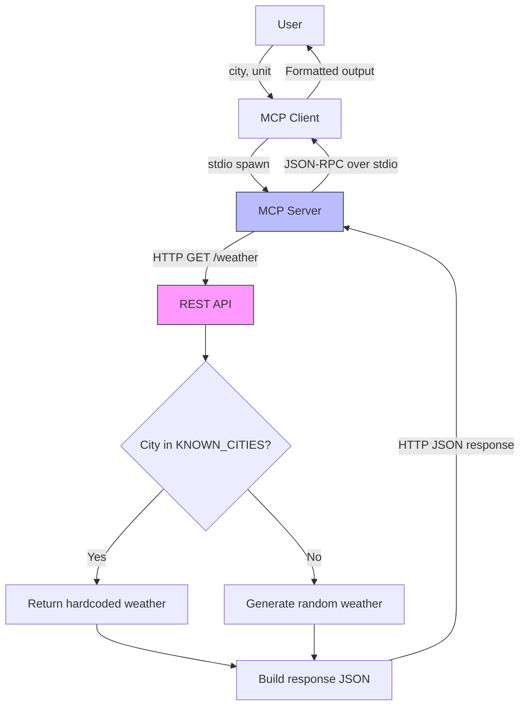

# MCP Weather PoC

A **Model Context Protocol (MCP)** proof-of-concept that exposes a `get_weather` tool over **stdio** transport. The MCP server acts as a **protocol adapter** — it does not generate data itself but fetches it from a REST API via HTTP, then serves it to the LLM client through MCP.

---

## Architecture Overview

The project follows a **three-layer architecture** that cleanly separates concerns:

```
LLM Client (client.py)
    ↓  stdio (MCP protocol / JSON-RPC)
MCP Server (server.py)            ← protocol adapter, no data logic
    ↓  HTTP (httpx)
REST API   (weather_api.py)       ← data source (mock for PoC)
```

| Component | File | Role |
|-----------|------|------|
| **REST API** | `weather_api.py` | FastAPI service that provides weather data. Currently returns mock/simulated data; swap the URL for a real API (e.g. OpenWeatherMap) in production. |
| **MCP Server** | `server.py` | Registers the `get_weather` tool via `FastMCP`, listens on **stdio**, and proxies requests to the REST API using `httpx`. |
| **MCP Client** | `client.py` | Test harness that starts the mock API, spawns the MCP server, discovers tools, runs validation tests, and tears everything down. |

### Key Design Decisions

- **Separation of concerns** — the MCP server contains zero data logic; it only translates between MCP protocol and HTTP. This makes switching from mock to real API a one-line config change.
- **Environment-based configuration** — set `WEATHER_API_BASE_URL` to point the MCP server at any compatible REST endpoint.
- **stdio transport** — the client spawns the server as a child process; all JSON-RPC messages flow through stdin/stdout pipes.
- **Input validation** — city names are restricted to letters, spaces, and hyphens; unit must be `celsius` or `fahrenheit`. Validation happens at both the MCP server (pre-flight) and REST API layers.

---

## Sequence Diagram



---

## Data Flow Diagram



---

## Response Schema

The `get_weather` tool returns a JSON object with the following structure:

```json
{
  "city": "Istanbul",
  "temperature": 18.5,
  "unit": "celsius",
  "condition": "Cloudy",
  "timestamp": "2026-02-22T12:00:00Z"
}
```

| Field | Type | Description |
|-------|------|-------------|
| `city` | `string` | Title-cased city name |
| `temperature` | `float` | Temperature in the requested unit |
| `unit` | `string` | `"celsius"` or `"fahrenheit"` |
| `condition` | `enum` | One of `Sunny`, `Cloudy`, `Rainy`, `Snowy` |
| `timestamp` | `string` | ISO 8601 UTC timestamp |

---

## Getting Started

### 1. Install dependencies

```sh
pip install -r requirements.txt
```

### 2. Start the mock REST API

```sh
uvicorn weather_api:app --host 127.0.0.1 --port 8000
```

### 3. Run the MCP server standalone (stdio)

In a separate terminal (the server reads JSON-RPC from stdin):

```sh
# Uses the default API URL http://127.0.0.1:8000
python server.py

# Or point to a different API:
# set WEATHER_API_BASE_URL=https://real-api.example.com
# python server.py
```

### 4. Run the full test suite (starts everything automatically)

```sh
python client.py
```

The test client automatically starts the mock API, runs all tests, and shuts everything down.

---

## Switching to a Real API

The MCP server uses the `WEATHER_API_BASE_URL` environment variable to locate the data source. To point it at a real weather API:

```sh
set WEATHER_API_BASE_URL=https://api.openweathermap.org/data/2.5
python server.py
```

> **Note:** You may need a thin adapter layer if the real API's response schema differs from the PoC schema.

---

## Using with MCP Hosts (Claude Desktop, VS Code, etc.)

> **Prerequisite:** The REST API must be running (or `WEATHER_API_BASE_URL` must point to a live endpoint).

Add the following to your MCP client configuration:

```json
{
  "mcpServers": {
    "weather-service": {
      "command": "python",
      "args": ["path/to/server.py"],
      "env": {
        "WEATHER_API_BASE_URL": "http://127.0.0.1:8000"
      }
    }
  }
}
```

---

## Project Structure

```
├── weather_api.py             # Mock REST API (FastAPI) – data source
├── server.py                  # MCP server – protocol adapter (httpx → MCP)
├── client.py                  # MCP client – test harness with validation
├── requirements.txt           # Python dependencies
├── mcp-weather-poc-spec.md    # Original specification document
└── README.md                  # This file
```
