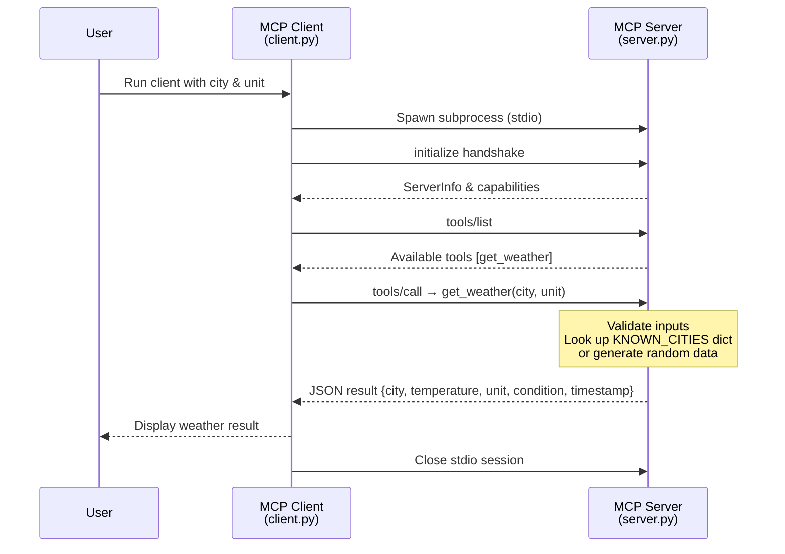
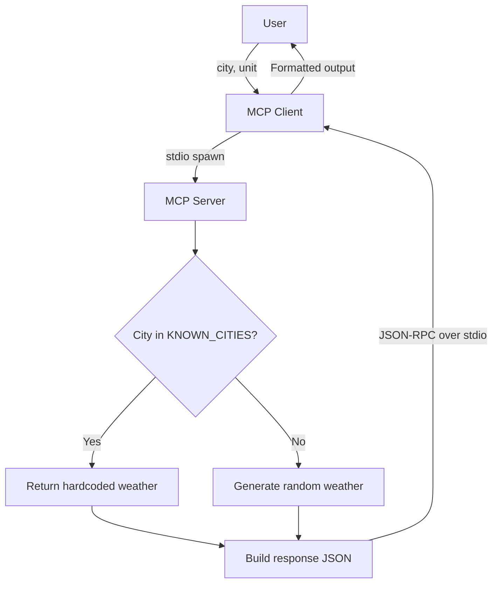

# MCP Weather PoC

A **Model Context Protocol (MCP)** proof-of-concept that exposes a `get_weather` tool over **stdio** transport. An MCP client connects to the server, discovers the tool, and invokes it to retrieve simulated weather data.

---

## Architecture Overview

The project consists of two main components:

| Component | File | Role |
|-----------|------|------|
| **MCP Server** | `server.py` | Registers the `get_weather` tool via `FastMCP` and listens on **stdio**. Returns simulated weather data for known cities or randomly generated data for unknown ones. |
| **MCP Client** | `client.py` | Launches the server as a subprocess, connects over **stdio**, discovers available tools, and calls `get_weather` with user-provided parameters. |

### Key Design Decisions

- **No real API** — weather data is either pulled from a hardcoded dictionary (`KNOWN_CITIES`) or generated randomly, keeping the PoC dependency-free.
- **stdio transport** — the client spawns the server as a child process; all JSON-RPC messages flow through stdin/stdout pipes.
- **Input validation** — city names are restricted to letters, spaces, and hyphens; unit must be `celsius` or `fahrenheit`.

---

## Sequence Diagram



---

## Data Flow Diagram



---

## Response Schema

The `get_weather` tool returns a JSON object with the following structure:

```json
{
  "city": "Istanbul",
  "temperature": 18.5,
  "unit": "celsius",
  "condition": "Cloudy",
  "timestamp": "2026-02-22T12:00:00Z"
}
```

| Field | Type | Description |
|-------|------|-------------|
| `city` | `string` | Title-cased city name |
| `temperature` | `float` | Temperature in the requested unit |
| `unit` | `string` | `"celsius"` or `"fahrenheit"` |
| `condition` | `enum` | One of `Sunny`, `Cloudy`, `Rainy`, `Snowy` |
| `timestamp` | `string` | ISO 8601 UTC timestamp |

---

## Getting Started

### 1. Install dependencies

```sh
pip install -r requirements.txt
```

### 2. Run the server standalone (stdio)

```sh
python server.py
```

### 3. Run the test client (spawns the server automatically)

```sh
python client.py
```

---

## Using with MCP Hosts (Claude Desktop, VS Code, etc.)

Add the following to your MCP client configuration:

```json
{
  "mcpServers": {
    "weather-service": {
      "command": "python",
      "args": ["path/to/server.py"]
    }
  }
}
```

---

## Project Structure

```
├── server.py                  # MCP server – exposes get_weather tool
├── client.py                  # MCP client – test harness with validation
├── requirements.txt           # Python dependencies
├── mcp-weather-poc-spec.md    # Original specification document
└── README.md                  # This file
```
