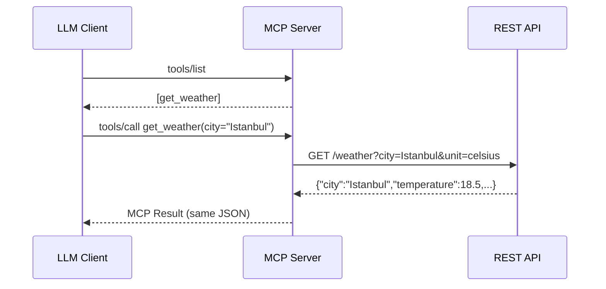

# Building an MCP Server That Talks to a Real API — A Practical PoC

Large Language Models are powerful, but they can't reach the outside world on their own. **Model Context Protocol (MCP)** solves this by giving LLMs a standardized way to call external tools. In this post, we'll build a working MCP server that fetches live weather data from a REST API — and show why the architecture matters more than the code.

---

## The Problem: LLMs Need a Bridge

When a user asks *"What's the weather in Istanbul?"*, the LLM has two options:

1. **Hallucinate** — guess from training data (bad)
2. **Call a tool** — fetch real data through a protocol (good)

MCP is that protocol. It defines how an LLM client discovers tools, calls them, and receives structured results — all over a simple stdio pipe.

---

## Architecture: Three Layers, One Responsibility Each

The key insight is **separation of concerns**. The MCP server should never generate data — it's just a translator between two worlds:

```
┌─────────────┐     stdio / JSON-RPC     ┌─────────────┐     HTTP / REST     ┌─────────────┐
│  LLM Client │ ◄──────────────────────► │  MCP Server │ ──────────────────► │  REST API   │
│  (client.py) │                          │ (server.py)  │                     │(weather_api) │
└─────────────┘                          └─────────────┘                     └─────────────┘
                                          Protocol Adapter                    Data Source
```

| Layer | Responsibility | Changes When... |
|-------|---------------|-----------------|
| **REST API** | Owns the data and business logic | Data source changes |
| **MCP Server** | Translates HTTP ↔ MCP protocol | MCP spec changes |
| **LLM Client** | Discovers and calls tools | User requirements change |

This means switching from mock data to OpenWeatherMap is a **one-line config change** — not a rewrite.

---

## The Code

### 1. REST API (`weather_api.py`) — The Data Source

A simple FastAPI service that returns weather data. In this PoC it uses mock data, but the contract is identical to what a real API would return:

```python
@app.get("/weather")
def get_weather(
    city: str = Query(...),
    unit: str = Query("celsius"),
) -> dict[str, Any]:
    # Validate inputs
    # Look up or generate weather data
    return {
        "city": city.strip().title(),
        "temperature": 18.5,
        "unit": unit,
        "condition": "Cloudy",
        "timestamp": "2026-02-26T12:00:00Z",
    }
```

### 2. MCP Server (`server.py`) — The Protocol Adapter

The server registers a `get_weather` tool and proxies every call to the REST API via `httpx`. It contains **zero data logic**:

```python
WEATHER_API_BASE_URL = os.environ.get("WEATHER_API_BASE_URL", "http://127.0.0.1:8000")

mcp = FastMCP(name="weather-service")

async def _fetch_weather(city: str, unit: str) -> dict[str, Any]:
    async with httpx.AsyncClient(timeout=10.0) as client:
        response = await client.get(
            f"{WEATHER_API_BASE_URL}/weather",
            params={"city": city, "unit": unit},
        )
    response.raise_for_status()
    return response.json()

@mcp.tool(name="get_weather")
async def get_weather(city: str, unit: str = "celsius") -> dict[str, Any]:
    return await _fetch_weather(city.strip(), unit)
```

The `WEATHER_API_BASE_URL` environment variable is the only thing you change when going to production.

### 3. MCP Client (`client.py`) — The Test Harness

The client starts the mock API, spawns the MCP server, and runs a full test suite:

```python
# Start mock API in background
api_process = subprocess.Popen([sys.executable, "-m", "uvicorn", "weather_api:app", ...])

# Connect to MCP server over stdio
async with stdio_client(server_params) as (read, write):
    async with ClientSession(read, write) as session:
        await session.initialize()
        tools = await session.list_tools()          # discover tools
        result = await session.call_tool("get_weather", {"city": "Istanbul"})
```

---

## Request Lifecycle



---

## Switching to Production

Replace the mock API URL with a real one — that's it:

```json
{
  "mcpServers": {
    "weather-service": {
      "command": "python",
      "args": ["server.py"],
      "env": {
        "WEATHER_API_BASE_URL": "https://api.openweathermap.org/data/2.5"
      }
    }
  }
}
```

If the real API's response schema differs, add a thin adapter function in `_fetch_weather` to normalize the response. The MCP layer and client remain untouched.

---

## Key Takeaways

1. **MCP servers are adapters, not services** — they translate protocols, not generate data.
2. **Separate data from transport** — put business logic in the API, protocol logic in the MCP server.
3. **Use environment variables for configuration** — switching data sources shouldn't require code changes.
4. **Validate at both layers** — the MCP server catches obvious bad input before hitting the network; the API enforces business rules.

The full source code is available in the repository. Run `pip install -r requirements.txt` and `python client.py` to see all five tests pass.
